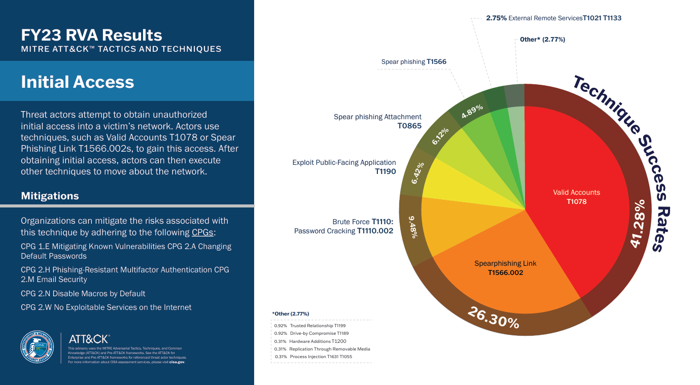
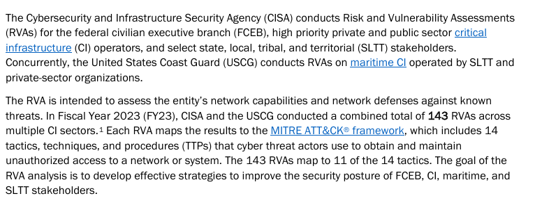

# CTI_Assignment_Meetkumar_Patel

**Overview**

This report presents the Fiscal Year 2023 Risk and Vulnerability Assessments (RVA) conducted by the Cybersecurity and Infrastructure Security Agency (CISA). It analyzes various cyber threats and vulnerabilities targeting critical infrastructure, federal civilian agencies, and state, local, tribal, and territorial entities. The report highlights key adversary groups, their attack techniques, infrastructure employed, capabilities, and targeted sectors. It provides actionable intelligence for improving cybersecurity defenses and risk management across vital U.S. sectors.

 ## **Task 3: Diamond Model Vertex Extraction** 
| Diamond Model Vertex | Observed Details                                                                                  | Supported Evidence                                                                                     |
|---------------------|---------------------------------------------------------------------------------------------------|-----------------------------------------------------------------------------------------------------|
| **Adversary**       | Chinese cyber espionage groups (e.g., APT15, APT31, Volt Typhoon, UNC5174) targeting U.S. sectors | Named groups and activities documented in CISA's FY23 RVA Analysis report, including spear phishing campaigns and public-facing app exploitation  |
| **Infrastructure**  | Command-line tools, Living-Off-The-Land binaries, VPNs, RDP, Citrix Netscaler, CobaltStrike, DNS-over-HTTPS | Observations of native tools, compromised VPN and RDP, use of malware frameworks and encrypted channels detailed in the report. One evidence from the report:  |
| **Capability**      | Spear phishing, use of valid credentials, malware deployment (CobaltStrike, RESHELL, XDealer), privilege escalation, defense evasion | Technical descriptions of attack techniques mapped to MITRE ATT&CK tactics, including credential dumping and lateral movement  |
| **Victim**          | U.S. federal civilian executive branch, critical infrastructure sectors, and SLTT entities      | Identification of target sectors, including energy, finance, water, transportation as vulnerable entities in the FY23 RVA report  |

## **Task 5: Threat Actor Profile Summary**

**Actor Names:** Multiple Chinese state-sponsored cyber espionage groups, including APT15, APT31, Volt Typhoon, Storm-0558, UNC5174, are key adversaries operating against U.S. sectors. These groups employ advanced tactics for intelligence gathering related to military, economic, and governmental objectives.

**Targeted Sectors:** The victims include the U.S. federal civilian executive branch, critical infrastructure sectors such as energy, finance, water, transportation, and agriculture, and state, local, tribal, and territorial entities.

**Attack Vectors & Initial Access methods:**
Their initial access methods predominantly include spear phishing campaigns, exploitation of public-facing applications, and the use of valid credentials obtained through credential dumping or theft. These adversaries leverage living-off-the-land techniques by using native system tools and utilities to maintain stealth and persistence within victim networks.

**Diamond Model Analysis:**
The Diamond Model analysis highlights the relationships between the threat actors (Adversaries), their employed infrastructures such as VPNs, Remote Desktop Protocol, and malware like CobaltStrike and RESHELL (Infrastructure), the wide spectrum of capabilities involving privilege escalation, defense evasion, lateral movement, and obfuscated command and control communications (Capabilities), and the targeted victims spanning multiple critical sectors (Victims).

**Mitigation Strategies:**

Implement phishing-resistant multi-factor authentication and strong password policies, including unique credentials and revocation of unnecessary accounts.

Maintain up-to-date patches for public-facing software and secure configuration baselines (e.g., disabling macros by default).

Enforce network segmentation, blocking unnecessary outbound connections, and employing demilitarized zones (DMZs).

Use email filtering and authentication protocols (SPF, DKIM) to prevent phishing and spoofing.

Monitor logs for suspicious activity and audit account usage to detect manipulation.

Deploy centralized cyber threat intelligence platforms for timely detection and response.

Secure sensitive data via encryption and limit software to an allowlist of approved programs.

## **Task 6: Reflection**

**How does the Diamond Model help in understanding threat actors?**

The Diamond Model helps by breaking down complex cyber threats into four main parts: who the adversary is, the tools or infrastructure they use, their capabilities, and the victims they target. This clear structure makes it easier to understand how attacks happen and connect different parts of a cyber attack.

**What challenges did you face in identifying each vertex?**

Identifying the adversary is challenging due to limited or overlapping information about threat groups. Infrastructure is hard to find because attackers use different hidden tools. Capabilities can vary widely making it difficult to map every technique. Victim identification is sometimes unclear because attacks can affect many sectors and regions.

**How could this model support proactive defense strategies?**

The model enables defenders to anticipate attacker moves by understanding their infrastructure and capabilities. It helps prioritize defenses and monitor relevant threats. By knowing the victim profile, organizations can tailor prevention and detection efforts to reduce risks and respond more effectively.

## References

[CISA Analysis: FY23 Risk and Vulnerability Assessment](https://www.cisa.gov/sites/default/files/2024-09/FY23_RVA_Analysis_508.pdf)

[FY23 RVAs Mapped to the MITRE ATT&CK Framework Infographic](https://www.cisa.gov/sites/default/files/2024-09/InfographicFY23RVA508.pdf)

