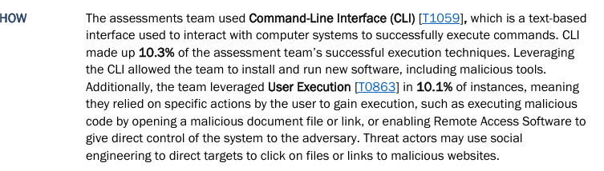

# CTI_Assignment_Meetkumar_Patel

**Overview**
This report presents the Fiscal Year 2023 Risk and Vulnerability Assessments (RVA) conducted by the Cybersecurity and Infrastructure Security Agency (CISA). It analyzes various cyber threats and vulnerabilities targeting critical infrastructure, federal civilian agencies, and state, local, tribal, and territorial entities. The report highlights key adversary groups, their attack techniques, infrastructure employed, capabilities, and targeted sectors. It provides actionable intelligence for improving cybersecurity defenses and risk management across vital U.S. sectors.

**Task 3: Diamond Model Vertex Extraction** 
| Diamond Model Vertex | Observed Details                                                                                  | Supported Evidence                                                                                     |
|---------------------|---------------------------------------------------------------------------------------------------|-----------------------------------------------------------------------------------------------------|
| **Adversary**       | Chinese cyber espionage groups (e.g., APT15, APT31, Volt Typhoon, UNC5174) targeting U.S. sectors | Named groups and activities documented in CISA's FY23 RVA Analysis report, including spear phishing campaigns and public-facing app exploitation  |
| **Infrastructure**  | Command-line tools, Living-Off-The-Land binaries, VPNs, RDP, Citrix Netscaler, CobaltStrike, DNS-over-HTTPS | Observations of native tools, compromised VPN and RDP, use of malware frameworks and encrypted channels detailed in the report. One evidence from the report:  |
| **Capability**      | Spear phishing, use of valid credentials, malware deployment (CobaltStrike, RESHELL, XDealer), privilege escalation, defense evasion | Technical descriptions of attack techniques mapped to MITRE ATT&CK tactics, including credential dumping and lateral movement [attached_file:2] |
| **Victim**          | U.S. federal civilian executive branch, critical infrastructure sectors, and SLTT entities      | Identification of target sectors, including energy, finance, water, transportation as vulnerable entities in the FY23 RVA report [attached_file:2] |

